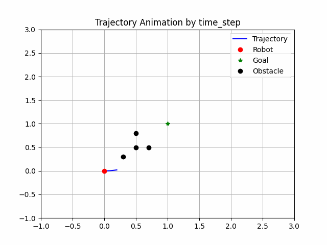

# DWA-planner

C++ simulation of differential drive robot using the Dynamic Window Approach

## Included
 - MotionPlanner ( Trajectory Generator, Trajectory Evaluator )
 - MotionController ( P Controller )
 - Example for Simulration
## Preview


## Usage
### Test Environment
 - C++17 compiler (GCC)
 - Cmake 3.10
 - Python3 (matplotlib and pandas libraries needed for visualization)
### Build & Run
```bash
git clone https://github.com/mkyun2/DWA-planner.git
cd DWA-planner
mkdir build & cd build
cmake ..
make
../output/simulate
